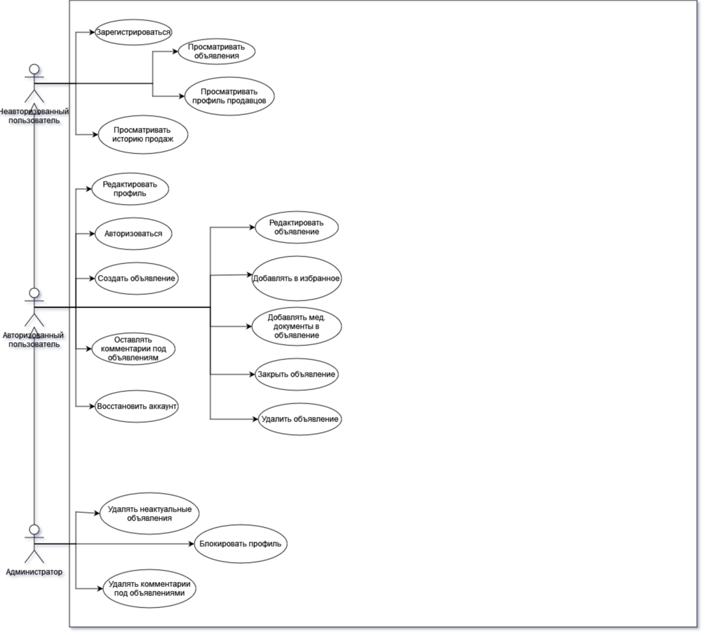
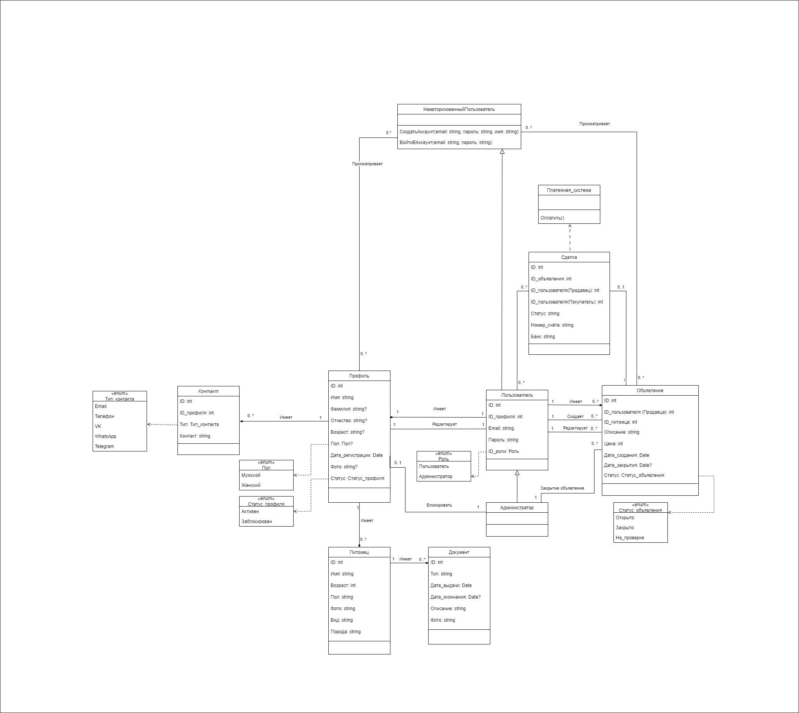
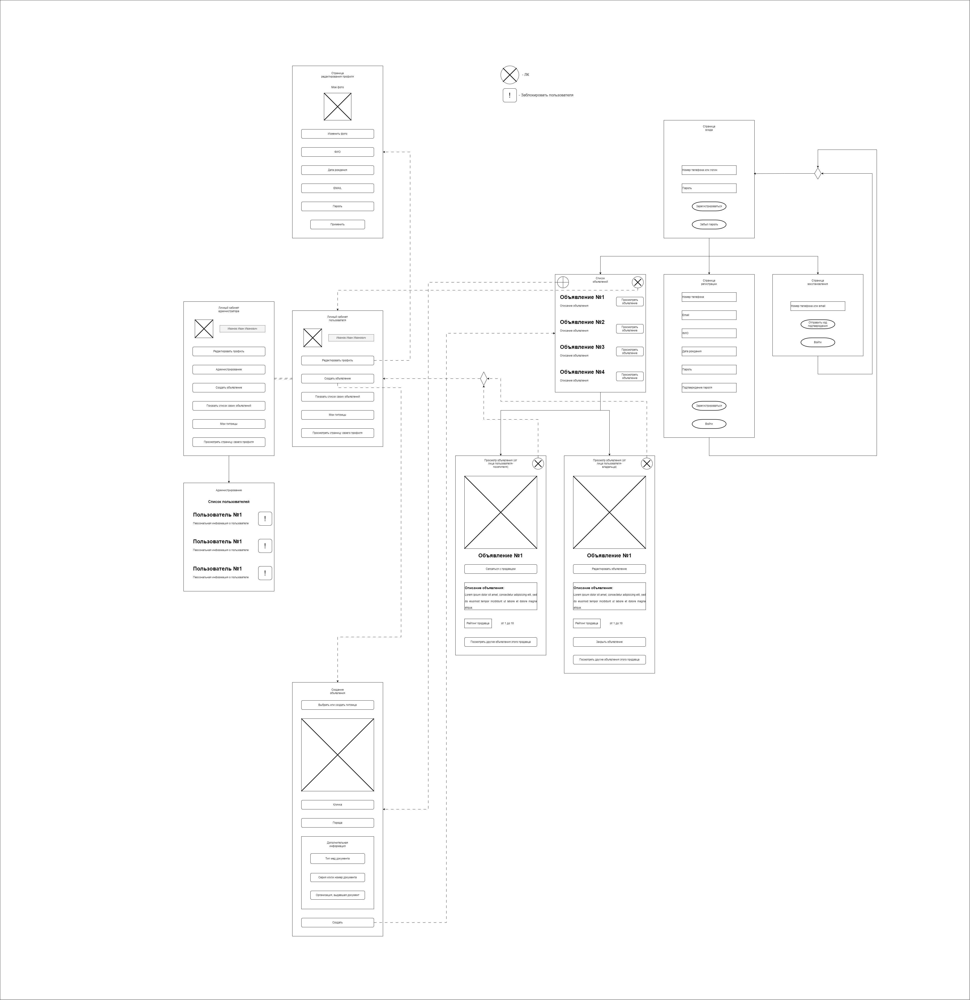
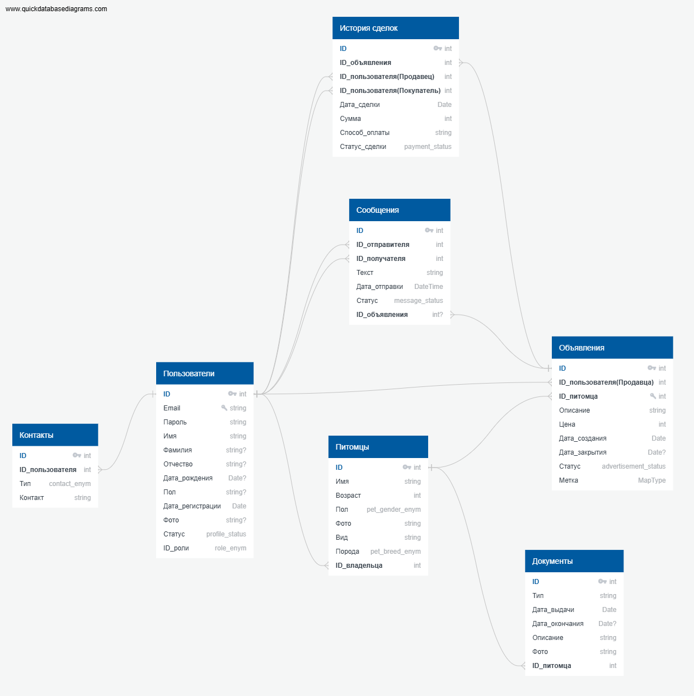
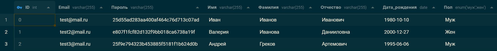
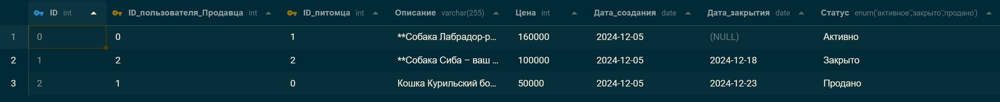
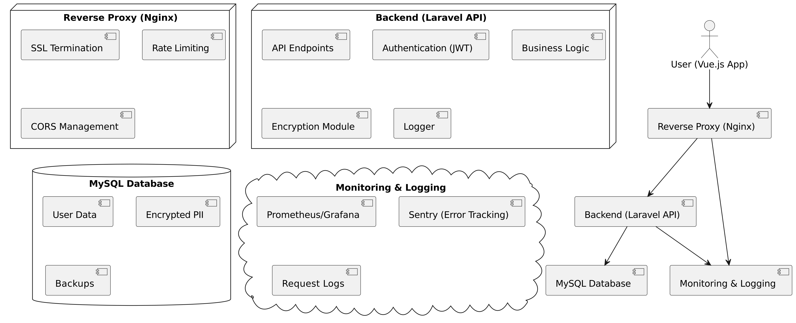

# Проект "My Pet"

## Описание проекта

Проект представляет собой систему для размещения объявлений пользователей о продаже и дарении домашних животных.

# Список участников

- Зорин Максим * (@LuckyMIX)
- Овчинников Илья (@dimseon)
- Гвоздев Вячеслав (@sw129)
- Пигута Болеслав (@NBW_MrColteR)
- Рудяков Анатолий (@incriz)

# План выполнения работ


|    **Статус**    | **Задача**                                                                                                                                         |
| :--------------------: | :------------------------------------------------------------------------------------------------------------------------------------------------------- |
| **Итерация 1** |                                                                                                                                                          |
|           ✅           | Разбиться на относительно большие команды                                                                           |
|           ✅           | Сформировать репозиторий                                                                                                          |
|           ✅           | Сформировать readme.md                                                                                                                       |
|           ✅           | Клонировать проект локально                                                                                                     |
|           ✅           | Выбрать лидера команды                                                                                                               |
|           ✅           | Научиться работать с markdown                                                                                                          |
|           ✅           | Реализовывать совместную работу                                                                                             |
|           ✅           | Выбрать тему проекта и подготовить презентацию                                                                  |
| **Итерация 2** |                                                                                                                                                          |
|           ✅           | Определить назначение системы                                                                                                 |
|           ✅           | Определить цели, преследуемые созданием системы(продукта)                                              |
|           ✅           | Определить список заинтересованных сторон и их потребностей                                         |
|           ✅           | Определить список внешних систем, с которыми может взаимодействовать наша система |
| **Итерация 3** |                                                                                                                                                          |
|           ✅           | Посмотреть результаты предыдущих итераций, доработать замечания и дополнения         |
|           ✅           | Выделить явных прямых пользователей системы, сформировать список                                |
|           ✅           | Выделить (явно) список внешних систем, с которыми взаимодействует наша система         |
|           ✅           | Построить диаграммы вариантов использования                                                                      |
|           ✅           | Составить беклог в виде user story при необходимости                                                                 |
|           ✅           | Составить список атрибутов качества, ограничений, бизнес-правил                                   |
| **Итерация 4** |                                                                                                                                                          |
|           ✅           | Составить ER-диаграмму                                                                                                                 |

# Заинтересованные лица


| **Наименование**               |                                                                                                              **Описание**                                                                                                              |
| :----------------------------------------- | :--------------------------------------------------------------------------------------------------------------------------------------------------------------------------------------------------------------------------------------------: |
| Владельцы без питомцев |                                                Пользователи различных возрастов, которые хотят выложить пост о своем питомце                                                |
| Владельцы с питомцами   |                                                        Пользователи различных возрастов, которые хотят найти своего питомца                                                        |
| Сотрудники                       | Проверка и редактирование обьявлений, связывает коммерческие/некоммерческие организации с нашей организацией по поводу рекламы |

# Внешние системы


| **Тип системы**                                                      | **Пример системы** |                          **Описание**                          |                                                        **Пример использования** |
| :----------------------------------------------------------------------------- | :-----------------------------: | :--------------------------------------------------------------------: | -------------------------------------------------------------------------------------------------: |
| Системы геолокации (планируется в будущем) |     Яндекс карты     |    Отображают адрес продавца на карте    |                                               Поиск объявлений поблизости |
|                                                                                |           Google map           |                                                                        |                                              Отображение на карте адресов |
| Платежные системы                                              |             Мир             |                Обрабатывают платежи                |                                                      Оплата товаров или услуг |
|                                                                                |             СБП             |                                                                        |                                                                                                    |
|                                                                                |             PayPal             |                                                                        |                                                                                                    |
|                                                                                |            WebMoney            |                                                                        |                                                                                                    |
| Системы для авторизации                                   |       ВКонтакте       | Предоставляют данные для авторизации |                                   Вход или регистрация через аккаунт |
|                                                                                |             Google             |                                                                        |           Ссылки в профиле на привязанные социальные сети |
|                                                                                |          Яндекс          |                                                                        |                                                                                                    |
| Системы электронной почты                               |     Яндекс Почта     | Отправляют уведомления пользователям | Отправка уведомлений о новых сообщениях или событиях |
|                                                                                |             Mail RU             |                                                                        |                                                                                                    |
|                                                                                |              Gmail              |                                                                        |                                                                                                    |
| Рекламные системы                                              |         Google AdSense         |          Позволяют размещать рекламу          |                         Монетизация сайта через рекламные блоки |
|                                                                                |    Яндекс Директ    |                                                                        |                                                                                                    |

# Use Cases



# User Stories

## Как не авторизированный пользователь я хочу:

1. Создавать учетную запись в приложении MyPets.
2. Просматривать объявления в приложении MyPets.
3. Просматривать профили продавцов в приложении MyPets.

## Как авторизированный пользователь я хочу:

1. Просматривать объявления о продажи животных в приложении MyPets.
2. Редактировать мой профиль в приложении MyPets.
3. Удалить мой профиль в приложении MyPets.
4. Просматривать профили продавцов в приложении MyPets.
5. Видеть историю сделок продавца.
6. Создавать объявление о продажи животных.
7. Добавлять в объявление о продажи медицинские документы.
8. Закрывать объявления о продажи животных.
9. Добавлять понравившееся объявление в избранное.

## Как администратор я хочу:

1. Просматривать объявления о продажи животных в приложении MyPets.
2. Просматривать профили продавцов.
3. Удалять неактуальные объявления о продажи животных в приложении MyPets.
4. Блокировать профили в приложении MyPets.

# Атрибуты качества


| **Атрибут качества**         |                                                          **Требование к системе**                                                          |
| :------------------------------------------ | :-----------------------------------------------------------------------------------------------------------------------------------------------------------: |
| Надежность                        |                        Обеспечение стабильной работы приложения без сбоев и ошибок                        |
| Удобство использования | Способность приложения эффективно обрабатывать запросы и обеспечивать отзывчивость |
| Безопасность                    |    Защита конфиденциальности данных и предотвращение несанкционированного доступа    |
| Производительность        |              Создание интуитивно понятного и удобного интерфейса для пользователей              |
| Сопровождаемость            |                                Легкость поддержки, обновлений и устранения ошибок                                |

# Атрибуты ограничений


| **Атрибут ограничений** |                                                **Требования к системе**                                                |
| :---------------------------------------- | :--------------------------------------------------------------------------------------------------------------------------------------: |
| Бюждет                              | Ограничения по финансовым ресурсам для разработки и поддержки приложения |
| Временные рамки             |  Сроки, в которые необходимо завершить разработку и выпустить приложение  |
| Ограничения знаний       |                                            У разработчиков мало опыта                                            |

# Бизнес-правила


| **Бизнес-правило**                                                                                                       |                                                                                                                                                                                                                  **Требования к системе**                                                                                                                                                                                                                  |
| :------------------------------------------------------------------------------------------------------------------------------------ | :--------------------------------------------------------------------------------------------------------------------------------------------------------------------------------------------------------------------------------------------------------------------------------------------------------------------------------------------------------------------------------------------------------------------------------------------------------------------------: |
| Обеспечить надежность работы приложения в любых условиях.                           |                                           Разработать систему мониторинга производительности и доступности приложения, реализовать механизмы резервного копирования данных, проводить регулярные тесты на прочность и отказоустойчивость системы.                                           |
| Поддерживать высокий уровень удобства использования для пользователей. | Реализовать простой и интуитивно понятный интерфейс приложения, обеспечивать быструю загрузку, минимизировать количество кликов для осуществления действий, проводить тестирование пользовательского опыта и учитывать обратную связь пользователей. |

# Дополнительные материалы

- [Презентация - 2 итерация](https://docs.google.com/presentation/d/1CKpK3zMH-2JOCmEP2eT4igdKhnbb5PSI/edit#slide=id.p1)
- [Презентация - 3 итерация](https://docs.google.com/presentation/d/1anC2PfXsj7O7-wJt82ZYhmWUuNbMYA4IsOIIubu5-Js/edit#slide=id.p1)

# Диаграмма классов



# Экранные формы



# Схема БД



[Online Edit](https://app.quickdatabasediagrams.com/#/d/IOIpYS)

# Пример заполненных данных

```
[{
    "ID": 0,
    "Email": "test@mail.ru",
    "Пароль": "25d55ad283aa400af464c76d713c07ad",
    "Имя": "Иван",
    "Фамилия": "Иванов",
    "Отчество": "Иванович",
    "Дата_рождения": "1980-10-10",
    "Пол": "Муж",
    "Дата_регистрации": "2024-12-05",
    "Фото": "https://myURL.com/img/img_1.jpg",
    "Статус": "Активен",
    "Роль": "Администратор"
},
{
    "ID": 1,
    "Email": "test2@mail.ru",
    "Пароль": "e807f1fcf82d132f9bb018ca6738a19f",
    "Имя": "Валерия",
    "Фамилия": "Иванова",
    "Отчество": "Данииловна",
    "Дата_рождения": "2000-12-27",
    "Пол": "Жен",
    "Дата_регистрации": "2024-10-01",
    "Фото": "https://myURL.com/img/img_2.jpg",
    "Статус": "Заблокирован",
    "Роль": "Гость"
},
{
    "ID": 2,
    "Email": "test3@mail.ru",
    "Пароль": "25f9e794323b453885f5181f1b624d0b",
    "Имя": "Андрей",
    "Фамилия": "Греков",
    "Отчество": "Артемович",
    "Дата_рождения": "1995-06-06",
    "Пол": "Муж",
    "Дата_регистрации": "2024-11-09",
    "Фото": null,
    "Статус": "Неактивен",
    "Роль": "Гость"
}]
```



```
[
  {
    "ID": 0,
    "ID_пользователя_Продавца": 0,
    "ID_питомца": 1,
    "Описание": "**Собака Лабрадор-ретривер: верный друг и незаменимый член семьи!**  Представляем вам настоящего компаньона — Лабрадор-ретривера! Этот удивительный питомец обладает уникальными качествами, которые делают его идеальным выбором для семей с детьми, активных людей и всех, кто ищет верного друга на всю жизнь.  **Уникальные особенности:** Лабрадор-ретриверы славятся своим дружелюбным характером и высокой интеллигентностью. Они легко обучаются и готовы стать участниками вашей жизни: от утренних пробежек до уютных вечеров на диване. Эти собаки известны своим терпением и ласковым нравом, что делает их идеальными для семей с детьми. Забудьте о беспокойствах — ваш Лабрадор станет защитником и лучшим другом для ваших малышей!  **Преимущества Лабрадора:** - **Энергия и активность:** Лабрадоры — настоящие энергайзеры! Они обожают активные прогулки и игры, что делает их идеальными компаньонами для любителей спорта и активного образа жизни. - **Социальность:** Эти собаки легко находят общий язык с другими животными и людьми. Лабрадор станет не только вашим другом, но и надежным союзником в общении с окружающими. - **Интеллект и обучаемость:** Лабрадоры — одни из самых умных пород. Они быстро усваивают команды и трюки, что делает их прекрасными помощниками в обучении и воспитании.  **Как Лабрадор решает ваши проблемы:** Нужен верный друг, который поднимет настроение после тяжелого дня? Лабрадор — это ваша находка! Его позитивный настрой и искреннее желание быть рядом сделают каждый день ярче. Благодаря своей дружелюбной натуре, он поможет вам завести новые знакомства и расширить круг общения, ведь с таким питомцем вы всегда в центре внимания!  **Не упустите возможность изменить свою жизнь к лучшему!** Собака Лабрадор-ретривер — это не просто питомец, это член семьи, который научит вас безусловной любви и дружбе. Возможно, именно сейчас — самое время подарить себе и своим близким это удивительное счастье! Сделайте шаг навстречу новым эмоциям и приключениям, которые принесет вам Лабрадор.  **Закажите своего Лабрадора-ретривера уже сегодня и откройте для себя мир бесконечной любви и преданности!**",
    "Цена": 160000,
    "Дата_создания": "2024-12-05",
    "Дата_закрытия": null,
    "Статус": "Активно",
    "Метка": null
  },
  {
    "ID": 1,
    "ID_пользователя_Продавца": 2,
    "ID_питомца": 2,
    "Описание": "**Собака Сиба – ваш идеальный компаньон!**  Представляем вам удивительное создание природы – собаку Сиба, известную своим обаянием и непревзойденным характером! Эта порода, родом из Японии, сочетает в себе элегантность, ум и независимость, что делает её идеальным спутником для активных людей и семей с детьми.  **Уникальные особенности Сиба-ину:**  - **Яркая индивидуальность**: Сиба-ину славится своим задорным и игривым нравом, что делает каждую прогулку настоящим событием. Эта собака – не просто питомец, а настоящий член вашей семьи, который всегда готов поддержать вас в любой ситуации.  - **Легкость в уходе**: Благодаря своему короткому и густому шерстяному покрову, Сиба-ину легко ухаживать. Её шерсть не требует сложного ухода, а периодическая чистка подарит вам и вашему питомцу радость общения.  - **Отличное здоровье**: Сиба-ину отличается крепким здоровьем и жизненной энергией. Эта порода устойчива к болезням и прекрасно адаптируется к разным климатическим условиям, что делает её идеальной для жизни в городе и за его пределами.  - **Интеллект и обучаемость**: Сиба-ину умна и сообразительна. Она быстро осваивает команды и трюки, что делает обучение не только полезным, но и увлекательным процессом для вас обоих. Каждое ваше взаимодействие будет приносить радость и удовлетворение!  **Решение для вашей повседневной жизни:**  Ищете верного друга, который всегда поднимет вам настроение? Собаки Сиба-ину – это не просто животные, а настоящие эмоциональные поддержатели. Их веселый характер и игривый нрав способны сделать любой день ярче и дружелюбнее. Сиба-ину отлично подходит для активных людей, которые любят долгие прогулки на свежем воздухе, а также для семей с детьми, которые ищут верного друга для совместных игр.  **Преимущества покупки Сиба-ину:**  - **Эмоциональная поддержка**: Эта собака станет вашим верным другом в трудные времена, обеспечивая неизменную преданность и любовь.  - **Безопасность и охрана**: Несмотря на свои небольшие размеры, Сиба-ину обладает природным инстинктом охраны, что делает её отличным защитником вашего дома и семьи.  - **Социальные связи**: Собаки Сиба-ину привлекают внимание и восхищение окружающих. Прогулки с ней станут отличной возможностью для новых знакомств и общения.  Не упустите шанс добавить в свою жизнь эту невероятную породу! Собака Сиба-ину – это не просто животное, это ваш верный друг, который сделает каждый день особенным. Закажите своего пушистого спутника уже сегодня и откройте для себя мир радости и любви!   **Ключевые слова:** Собака Сиба, Сиба-ину, порода собак, верный друг, эмоциональная поддержка, активный питомец, легкость в уходе.",
    "Цена": 100000,
    "Дата_создания": "2024-12-05",
    "Дата_закрытия": "2024-12-18",
    "Статус": "Закрыто",
    "Метка": null
  },
  {
    "ID": 2,
    "ID_пользователя_Продавца": 1,
    "ID_питомца": 0,
    "Описание": "Кошка Курильский бобтейл - это уникальная и очаровательная порода, которая завоевала сердца многих любителей кошек. Происходящие из России, эти кошки обладают необычным внешним видом и удивительными характеристиками.  Внешний вид: Курильский бобтейл отличается своим коротким хвостом, который может быть как коротким, так и полностью отсутствовать. Это делает их особенно привлекательными и уникальными среди других пород кошек. Шерсть у них короткая, плотная и мягкая на ощупь, что делает их приятными в обнимании. Окраска может варьироваться от светло-серого до темно-коричневого цвета, что добавляет им еще больше очарования.  Характер: Курильские бобтейлы известны своей дружелюбностью и игривостью. Они очень любят общение с людьми и часто проявляют интерес к играм и активным занятиям. Эти кошки также обладают высоким уровнем интеллекта, что делает их способными к обучению и выполнению различных команд. В то же время, они могут быть немного независимыми и требовать больше внимания от своих...",
    "Цена": 50000,
    "Дата_создания": "2024-12-05",
    "Дата_закрытия": "2024-12-23",
    "Статус": "Продано",
    "Метка": null
  }
]
```



## Примерная архитектура (RESTful):



[Итоговая презентация](https://docs.google.com/presentation/d/15rpXYQIQ2x6QUyK4r0MrqY1Uf7OP80x5Ladvir8KuaE/edit?usp=sharing)
